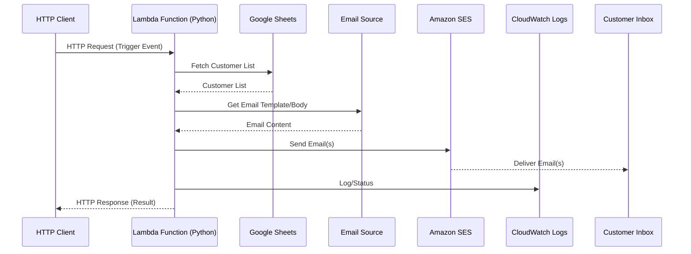

# AWS Lambda Email Service with Amazon SES and Google Sheets

## Architecture Diagram

## Description
- The Lambda function (Python) is triggered by an HTTP request containing the event data.
- It fetches the customer list from Google Sheets.
- It uses an email source (template/body) for the message content.
- For each customer, it sends an email using Amazon SES.
- Logs and status are sent to CloudWatch.
- Emails are delivered to customer inboxes.

## Next Steps
- Set up AWS Lambda and SES permissions.
- Configure access to Google Sheets API.
- Implement the Lambda function in Python.
