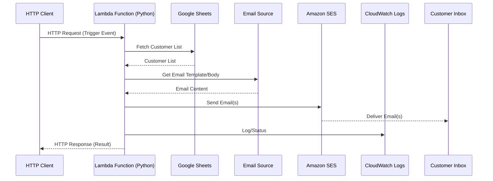

# AWS Lambda Email Service with Amazon SES and Google Sheets

## Architecture Diagram

## Description
- The Lambda function (Python) is triggered by an HTTP request containing the event data.
- It fetches the customer list from Google Sheets.
- It uses an email source (template/body) for the message content.
- For each customer, it sends an email using Amazon SES.
- Logs and status are sent to CloudWatch.
- Emails are delivered to customer inboxes.

## Next Steps
- Set up AWS Lambda and SES permissions.
- Configure access to Google Sheets API.
- Implement the Lambda function in Python.

## Using the AWS Toolkit to Test and Deploy

### Prerequisites
- Install the [AWS Toolkit for VS Code](https://docs.aws.amazon.com/toolkit-for-vscode/latest/userguide/welcome.html).
- Configure your AWS credentials in the AWS Toolkit.

### Testing the Lambda Function Locally
1. Open `lambda_function.py` in VS Code.
2. In the AWS Toolkit panel, locate your Lambda function.
3. Right-click the function and select **Invoke on AWS** or **Invoke Locally**.
4. Provide a sample event payload (JSON) when prompted.
5. View the results and logs in the AWS Toolkit output panel.

### Deploying the Lambda Function
1. Right-click `lambda_function.py` and select **Deploy Lambda Function**.
2. Follow the prompts to create a new Lambda or update an existing one.
3. Set the handler to `lambda_function.lambda_handler` if prompted.
4. After deployment, test the function from the AWS Toolkit or AWS Console.

### Additional Resources
- [AWS Toolkit for VS Code Documentation](https://docs.aws.amazon.com/toolkit-for-vscode/latest/userguide/lambda.html)

## Development in a Dev Container

This project includes a [dev container](.devcontainer/) for a fully configured development environment.

### Getting Started

1. **Open in VS Code**: Open this folder in [Visual Studio Code](https://code.visualstudio.com/).
2. **Reopen in Container**: When prompted, or via the Command Palette (`F1` > "Dev Containers: Reopen in Container"), open the workspace in the dev container.
3. **Ready to Develop**: The container includes Python 3, AWS CLI, AWS SAM CLI, `boto3`, and the AWS Toolkit extension.

### Useful Commands

- **Run Lambda Locally**: Use the AWS Toolkit or `sam local invoke` in the terminal.
- **Install Python Packages**: Use `pip install <package>` in the integrated terminal.
- **AWS CLI**: Use `aws` commands directly in the terminal.
